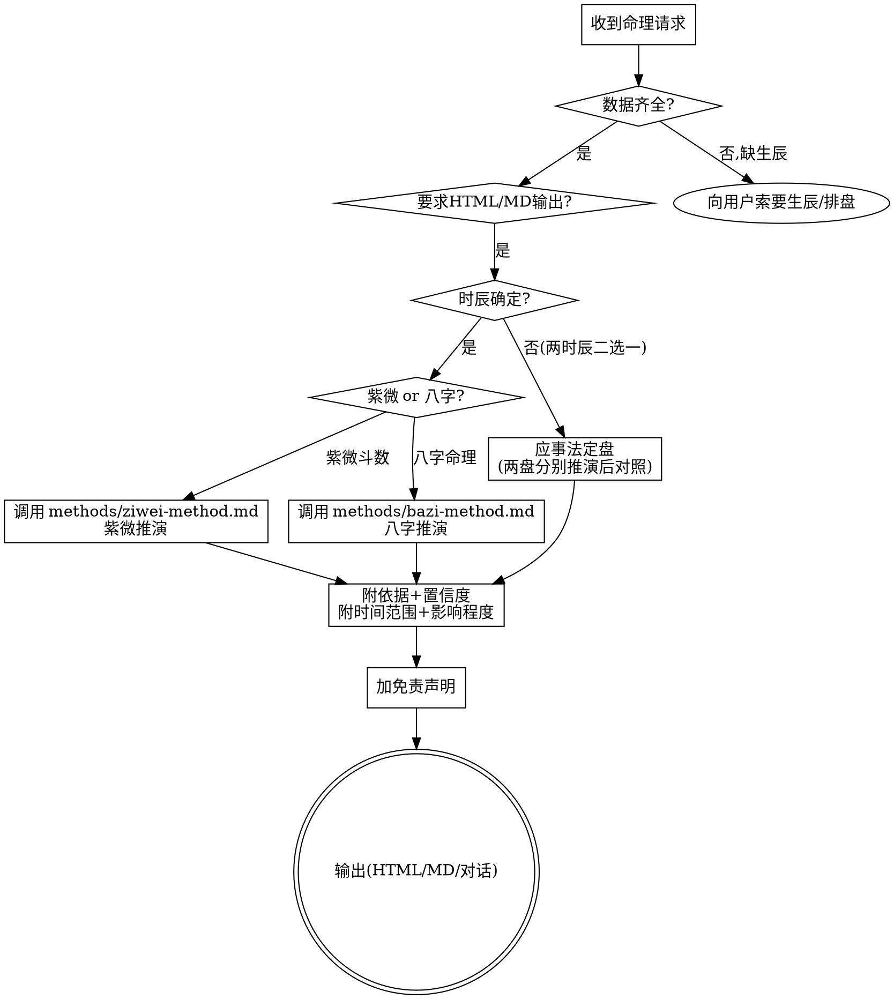

# 紫微斗数与八字命理推演

中国传统术数命理推演技能。包含**两套完全独立**的体系：紫微斗数（三合/飞星/河洛/钦天四化）与八字命理（子平四柱）。可各自独立推演，也可用"应事法"做时辰校验（定盘）。

## 何时使用

用户出现以下任一情况时调用：
- 要求**分析紫微斗数命盘**（给出安星码 / 排盘数据 / 十二宫星曜）
- 要求**批八字 / 四柱推命**（给出年月日时四柱）
- 要求**定盘 / 定时辰**（两个相邻时辰二选一，用已发生事件反推）
- 询问命运、运势、流年、婚姻、事业、财运、健康等**命理维度**并提供了生辰
- 要求**合盘 / 婚配 / 合作配对**（提供双方生辰，看感情婚姻或事业合作契合度）
- 要求把命理分析**输出为 HTML / Markdown 文档**

## 核心铁律（不可违背）

这是术数推演，不是代码——但**严谨性要求与代码同等**：

1. **只基于用户提供的数据推演**：所有星曜落宫、十神、四化、宫干，必须严格从用户给的排盘/四柱中得出。**不得凭空捏造**星曜位置、十神关系或四化落点。推演前先核对数据自洽性（如生年四化落宫是否与命盘标注一致）。

2. **绝不编造命主经历**：分析"应事"时，只能用**用户明确告知的真实事件**去验证命盘；不得臆测命主"应该"经历过什么来迎合结论。

3. **每条判断附依据与置信度**：重要结论标注依据来源（某宫星曜组合 / 某十神喜忌 / 某流年四化），并用 🟢高 / 🟡中 / 🔴低 标注置信度。吉凶判断给出**时间范围**与**影响程度**。术数断语尽量**标注来源类型**（`[古诀]`/`[命理共识]`/`[倪海厦视角]`/`[某派]`），便于用户判断派别属性；详见各 method 文件的标注规范小节。

4. **剔除营销与绝对化表述**：禁用"百分百准""必发财""命中注定离婚"等夸大断语；命理是概率性推断，用"倾向于""需注意""概率较高"等留有余地的表达。

5. **必加免责声明**：任何命理产出（无论 HTML/MD/对话）结尾**必须**附免责声明，说明仅限文化研究/娱乐、非科学、不替代专业决策。固定文本见文末。

6. **两套体系独立**：若用户要求分别用紫微和八字分析，**两份产出互不引用对方术语**——紫微文档不提十神/大运/喜用神；八字文档不提宫位/星曜/四化/大限。定盘时可分别得出结论后对照。

7. **定用神须四参合（八字）**：定真用神须「旺衰 + 格局 + 调候 + 流通」四参合（见 `methods/bazi-method.md` 第五节），**禁止单一旺衰机械判忌**——「缺五行不即忌」，缺/近缺的五行常是补缺、通关、泄秀所需之用（非忌）。引擎 `scripts/bazi_core.js` 的 `BAZI_SIHE` 开关（默认 on）即此四参合复核机制，可 `off` 对照旧旺衰。

8. **趋吉避凶·正向引导（产出口径·机制化）**：命理旨在给人希望与出路，非堆砌凶象。吉凶按原理如实推演，但解析必须给"转化路径"——凶运指出该往哪发力、为喜用运蓄什么力（婚姻凶转攻事业、财运凶深耕技术韬光养晦、官杀凶以技术学识化杀），**每个凶配一条出路**；禁绝对化与凶吓表述（用"需注意/宜 X"替代"大凶/必破"）。详见 `methods/bazi-method.md` 第十五节 与 `methods/ziwei-method.md` 第十一节。**机制化落实**：`data/empower.json` 积极赋能语料层（7 类：`interpret`/`geju`/`palace_sihua`/`bazi_trait`/`dayun`/`liunian`/`heming`）提供每条象的 `{judgment(如实断)+transform(转化)+action[](行动)+mindset(心态)}`，`scripts/_empower.js` 的 `lookup(category,key)` 供 `gen_*.js` 与 LLM prompt 查询；**所有 gen 产出对每个凶/特质/运势节点必须查 empower 配出路**，查不到走通用转化模板兜底。详见 `docs/specs/2026-06-26-积极赋能改造-design.md`。

9. **定盘多维度合参·应事三层引动**：定盘须综合人生经历多维度（学业/财运烈度/职业）+ 本人特征（体貌/六亲/健康），**禁凭单一事件/单一宫位下定盘结论**（印星有根是学业/技术/扛财的根本）。应事须看**原局（体）+ 大限 + 流年三层引动**（流年走宫/化忌入主星/害刑动六亲星），单看原局宫位会误判（如原局子女宫吉不排除流年化忌破）。详见 `methods/dingpan-logic.md`。

## 标准推演流程



**合盘分支**：当用户要求合盘/婚配/合作配对（提供双方生辰）时，**按需 Read** `methods/heming-method.md`（紫微合盘或八字合婚，依用户体系选择）→ 双方各自独立推演后对照合参。**不并入单盘推演流程**，仅在合盘请求时触发。

## 目录结构

```
ziwei-bazi-reading/
├── SKILL.md            # 本文件：入口 / 铁律 / 流程
├── methods/            # 推演方法论（紫微、八字各自独立，互不引用术语）
│   ├── ziwei-method.md
│   ├── bazi-method.md
│   ├── bazi-classics.md    # 八字古籍深论(格局/形性/寿元/女命/太岁/纳音/空亡·按需Read)
│   ├── ziwei-classics.md   # 紫微古籍深论(庙旺12宫/赋文/形性/格局成败/小限斗君·按需Read)
│   └── heming-method.md   # 合盘/婚配/合作配对专题（按需 Read）
├── corpus/             # 天纪倪师原话语料库 + 通识古诀（按需 Read，引用时溯源）
│   ├── verified/       # 倪师《天纪》原话（带集数出处）
│   ├── traditional/    # 紫微通识古诀（非倪师独创）
│   └── sources.md      # 资料来源清单
├── templates/          # 产出模板
│   └── ziwei-chart.html
├── scripts/            # 排盘脚本（紫微+八字均已接入，均 vendor 离线）
│   ├── paipan_ziwei.js     # 紫微(iztro v2.5.8)
│   ├── bazi.js             # 八字静态盘(tyme4ts + 关系层 + 神煞层)
│   ├── bazi_core.js        # 八字核心引擎(排盘+旺衰+流年,共用模块)
│   ├── bazi_liunian.js     # 八字流年逐年断 → JSON
│   ├── ziwei_liunian.js       # 紫微流年十维度 → JSON
│   ├── gen_liunian_html.js    # [已废弃]八字运势HTML—命书gen_bazi_full已一站式含运势,不再单独输出
│   ├── gen_ziwei_liunian_html.js # [已废弃]紫微运势HTML—命书gen_ziwei_full已一站式含运势,不再单独输出
│   ├── gen_bazi_full_html.js      # 八字【完整命书】HTML(命盘+藏干+纳音+五行+喜用+刑冲克害+神煞+LLM解读注入+大运+流年+折线图)
│   ├── gen_ziwei_full_html.js     # 紫微【完整命书】HTML(环形盘面+格局成格/凶格卡+疾厄脏腑卡+LLM解读注入+大限+流年)
│   ├── gen_heming_ziwei_html.js  # 紫微合盘HTML(双方关键宫联参+太阳太阴+四化互参+LLM五步法)
│   ├── gen_heming_bazi_html.js   # 八字合盘HTML(双方四柱+日主十神+纳音生克+神煞对比+LLM合婚)
│   ├── vendor/           # iztro+tyme4ts+自研层+运行时依赖 内置(离线,见 vendor/README.md)
│   └── README.md
└── data/               # 静态查表（藏干/四化/节气，两套共用）
    ├── canggan.json
    ├── sihua.json
    └── jieqi.json
```

**全流程数据流（紫微 + 八字均已打通）**：生辰 → `scripts/paipan_ziwei.js`（紫微 / iztro）或 `scripts/bazi.js`（八字 / tyme4ts+自研关系·神煞层）→ 结构化命盘 JSON → `methods/*`（推演）→ `templates/*`（渲染）。两引擎均已 vendor 内置、离线可用；脚本缺失时由用户提供排盘数据。**按需 Read** methods/ 与 corpus/ 对应文件，勿全量加载。引用倪师原话或古诀时查 `corpus/verified/`（倪师《天纪》原话，带集数出处）与 `corpus/traditional/`（通识古诀），确保引述准确、出处可溯。

- **紫微斗数推演**：`methods/ziwei-method.md`（独立体系，含十二宫、四化、大限流年、六维分析、格局速查）
- **八字命理推演**：`methods/bazi-method.md`（独立体系，含四柱十神、旺衰喜用、大运流年、应吉应凶、六亲对应；**定用神四参合见第五节**）

## 📂 workspace 工作目录（产出统一管理）

所有生成产出（命书/运势/合盘 HTML + 解读 JSON）默认写入 **workspace 工作目录**，集中管理、不散落、不入 git（`.gitignore` 已忽略 `workspace/` 与 `scripts/_*.json`）。

**路径解析优先级**（高 → 低，见 `scripts/_workspace.js`）：
1. 环境变量 `ZIWEI_WORKSPACE`
2. 项目级：技能根下 `.ziwei-workspace`（纯文本，一行路径）
3. 用户级：`~/.ziwei-workspace`（纯文本，一行路径）
4. 默认：`<技能根>/workspace`（项目级未配置时，在当前项目下创建）

**配置方法**：
- 临时/全局：`ZIWEI_WORKSPACE=/path/to/ws node scripts/gen_*.js ...`
- 项目级：技能根建 `.ziwei-workspace` 文件，写一行路径（相对路径相对技能根）
- 用户级：`~/.ziwei-workspace` 写一行路径（多项目共用同一 workspace 时用）

**使用**：跑 `gen_*_html` 脚本**无需传输出路径**，默认自动入 workspace；解读 JSON 也建议放 workspace（`ensureWorkspace()` 自动建目录）。示例：
```bash
# 命书默认入 workspace（outPath 留空用默认）
node scripts/gen_bazi_full_html.js 2000 8 16 14 30 男 1994 2080 "" workspace/_interp.json workspace/_liunian.json
# → <workspace>/八字命书-2000.html
```

## 应事法定时辰（通用核心）

当出生时辰在两个相邻时辰间不确定时（常见于记录模糊、真太阳时卡边界），用**已发生且记忆明确的人生事件**反推哪个命盘能对上。最强应事维度（按区分度排序）：

| 维度 | 紫微看什么 | 八字看什么 |
|---|---|---|
| 父亲 | 父母宫主星＋煞星（武曲擎羊火星主血光刑伤） | 偏财（父星）喜忌；父星忌年应凶 |
| 本人性格外貌 | 命宫主星组合 | 日主旺衰＋喜用（用印=技术内敛，用食伤=外向口才） |
| 健康/外伤 | 疾厄宫（七杀主手术，空宫主慢性） | 日主受克耗程度（甲木受耗=神经衰弱） |
| 事业类型 | 官禄宫主星（机梁=技术清高，机巨=口才成名） | 喜用神方向（用印=专业，用财官=经营） |
| 人生重心 | 身宫所在宫位 | 时柱十神（印=学业母缘，财=务实） |

**双向验证法**：对每个候选时辰，分别推演"某关键流年应吉还是应凶"，与命主真实事件对照——方向一致则该时辰成立，矛盾则排除。多组方向性验证同时成立，即为该时辰（非巧合）。

## 输出格式

### HTML（美观，推荐用于完整命盘报告）
单文件内联 CSS，中国风配色（紫微用朱红宣纸、八字用青蓝水墨以示区分）。必备区块：基本信息 → 排盘/十二宫 → 核心格局 → 六维详析 → 大限/大运 → 流年逐年表 → 综合建议 → 免责声明。吉凶用颜色编码。

**紫微盘面布局**：十二宫按地支顺时针排成环形（4×4 井字形外圈，中央 2×2 放命主信息）。直接套用 `templates/ziwei-chart.html`——已内置环形 grid、四化徽章、特殊宫位（命宫/身宫/来因宫）高亮、中央信息区，替换数据即可。文件顶部注释有套用 4 步说明。

### Markdown（轻量，用于对话内或快速报告）
同级标题分节，表格呈现流年/宫位，要点列表呈现建议。结尾附免责声明。

### LLM 解读 JSON（`_interp`）生成指导（prompt 固化）
`gen_*_full` 接收 `_interp` 解读 JSON（由 LLM 生成、命令行第 6/9 参数注入，注入后命书"命主总论/格局/宫象"等区块才有内容）。**生成 `_interp` 时遵循积极赋能四要点**：
1. **双轨**：每条命理判断含 `judgment`（如实断，不粉饰）+ `transform`（转化路径）+ `action`（行动指引）+ `mindset`（心态），与 `data/empower.json` 条目结构一致。
2. **积极基调**：凶象转"功课/守成期"、吉象转"顺势窗口"；禁凶吓（"必凶/死局/家破"），用"需注意/宜 X/课题在 X"。
3. **引 empower.json**：查 `data/empower.json` 对应象（interpret/geju/palace_sihua/bazi_trait/dayun/liunian/heming）的转化语，保持口径一致；查不到走通用转化模板（`_empower.genericTransform`）。
4. **结构**：`_interp = {命主身主, 格局, 五行局, 生年四化, 命主总论, 宫象:{各宫双轨}, 疾厄}` 等，每条双轨。

> 注：gen 代码层已**机制化兜底**——即使 `_interp` 仅含 `judgment`，gen 的 `interpret`/`interpretLN` 会自动对凶查 `empower.interpret` 配转化；但 `_interp` 本身双轨更佳（命主总论/格局等 LLM 区块也积极）。

## 免责声明（固定文本，产出必附）

> 本分析基于所提供的命盘/四柱数据，运用中国传统命理技法推演。命理学属于传统文化，**并非实证科学，不具备经过科学验证的预测能力**。所有吉凶判断、时间范围与建议，**仅适用于文化研究、自我觉察与娱乐参考，不能替代专业医疗诊断、心理咨询、法律意见、投资理财或婚姻决策**。命运由先天禀赋与后天选择共同塑造，理性看待、积极生活。如有实际困扰，请咨询专业持证人士。

## 常见误区

| 误区 | 正解 |
|---|---|
| 编造命主经历来"证明"某结论 | 只能用用户提供的真实事件验证，没提供就问，不要编 |
| 用绝对化断语（"必定""一定"） | 命理是概率推断，用"倾向于""需注意" |
| 紫微八字术语混用 | 两套独立，分别产出时互不引用 |
| 定盘只看单一事件 | 至少 3 组以上独立应事交叉验证，且含"方向性"（吉凶对错）验证 |
| 省略免责声明 | 任何命理产出结尾必加，无例外 |
